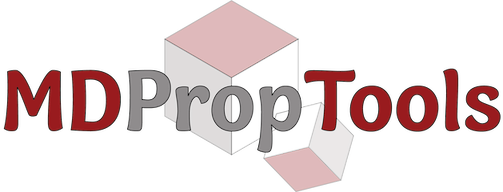

## MISPR Workshop - NAM Meeting

The MISPR Workshop is a workshop intended to learn to use the MolMD open-source tools. Topics will include basic running of density functional theory (DFT) and molecular dynamics (MD) simulations workflows and processing and visualizing computational results. 

## Table of Contents
1. [Overview](#Overview)
2. [How to Run](#Run1)
3. [Examples](#Examples)
    1. [Partial atomic charges](#DFT1)
    2. [Binding energy](#DFT2)
    3. [Modelling salt in water](#MD)
4. [License and Copyright](#License)

## Overview
This capsule contains tutorial for running automated materials science calculations using the following open-source sofware developed in the [MolMD group](https://www.stonybrook.edu/commcms/rajput-navnidhi/) at Stony Brook University. These include:
1. **MISPR**: a Python framework for coupled and automated DFT and MD simulations and analysis. 

2. **MDPropTools**: a python package for the temporal analysis of MD output and trajectory files to compute various structural and dynamical properties 

## How to Run
1. Create a Code Ocean account at [https://codeocean.com](https://codeocean.com) 
2. Check your email for an invitiation to use this capsule
3. Open the capsule and create a copy of it (upper left corner: Capule --> Duplicate)
4. Open the copied capsule and click on the Jupyter lab icon located at the top right corner. This will build the enviornment necessary for running the tutorials. It can take up to 15 minutes. 
4. Once completed, a Jupyter notebook will be open, where you can start running the examples provided in the *.ipynb files under **codes**

## Examples 
The examples provided in the canpsule show how to run the following calculations in an automated manner:
1. **Partial charges**: computes the charges on a molecule using DFT calculations 
2. **Binding energy**: calculates the binding energy between two molecules using DFT calculations 
3. **MD simulations**: modelling of NaCl in water and prediction of the density of the solution and the diffusion coefficients of its individual components 

These guided examples show how an entire set of calculations can be completed with minimal inputs and interference from the user. 

## License and Copyright
MIT License

Copyright (c) 2021 Stony Brook University

Permission is hereby granted, free of charge, to any person obtaining a copy
of this software and associated documentation files (the "Software"), to deal
in the Software without restriction, including without limitation the rights
to use, copy, modify, merge, publish, distribute, sublicense, and/or sell
copies of the Software, and to permit persons to whom the Software is
furnished to do so, subject to the following conditions:

The above copyright notice and this permission notice shall be included in all
copies or substantial portions of the Software.

THE SOFTWARE IS PROVIDED "AS IS", WITHOUT WARRANTY OF ANY KIND, EXPRESS OR
IMPLIED, INCLUDING BUT NOT LIMITED TO THE WARRANTIES OF MERCHANTABILITY,
FITNESS FOR A PARTICULAR PURPOSE AND NONINFRINGEMENT. IN NO EVENT SHALL THE
AUTHORS OR COPYRIGHT HOLDERS BE LIABLE FOR ANY CLAIM, DAMAGES OR OTHER
LIABILITY, WHETHER IN AN ACTION OF CONTRACT, TORT OR OTHERWISE, ARISING FROM,
OUT OF OR IN CONNECTION WITH THE SOFTWARE OR THE USE OR OTHER DEALINGS IN THE
SOFTWARE.